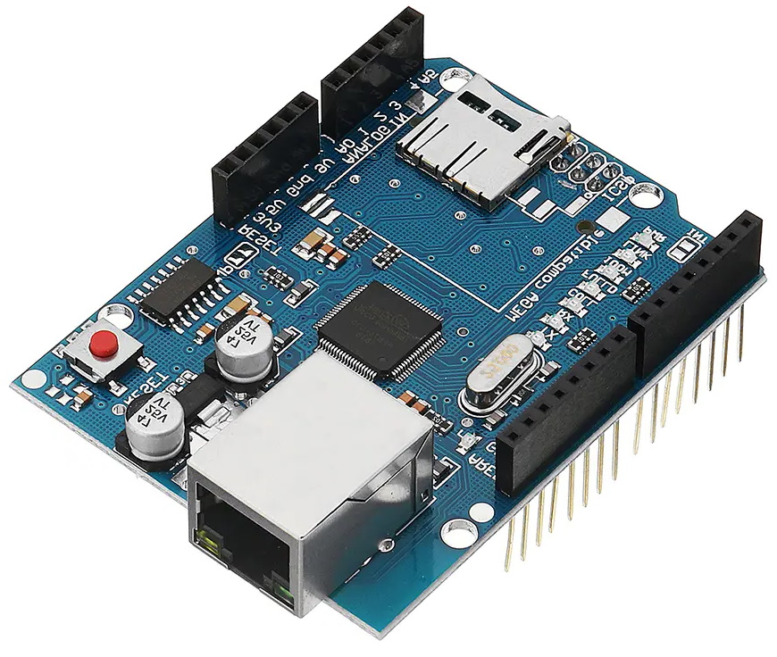
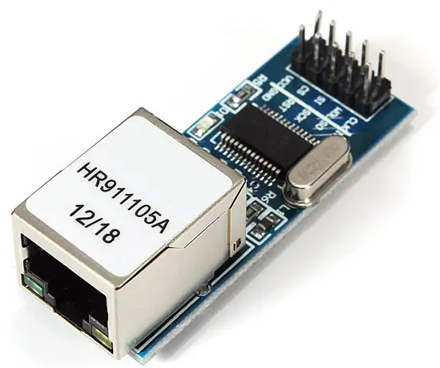
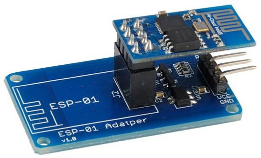
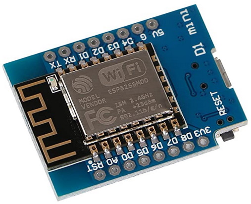
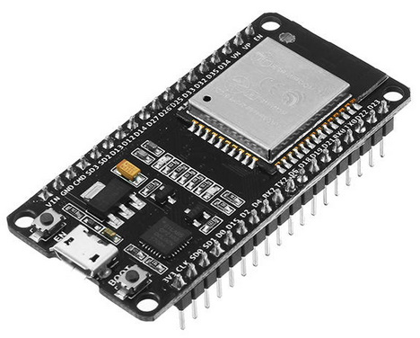

# arduino-networking
Wiring, software libraries, and example code of various common hardware used to create internet-enabled Arduino devices

During the current Covid-19 Coronavirus pandemic, many escape rooms owners have diversified into creating online/remote escape room experiences - in which a team of players guide a remote host, equipped with a Go-Pro camera, to solve puzzles in the room based on the player's commands. This approach gives me fond memories of the TV show Knightmare, but since all players' actions are mediated through a third person, it loses an element of the direct interaction that players normally experience.

One solution to this is to expose functionality of Arduino-powered props over a public web interface, allowing players to log-in via their browsers and release maglocks, turn on displays, or activate other electronic elements in the room environment. To do this, I'm going to do a bit of a roundup of the various choices of hardware and software that enable you to do that.

| Image | Chipset  | Type | Interface | Library  | Purchase |
| ----- | -------- | ---- | --------- | -------- | -------- |
|  | W5100 | Wired | SPI | https://github.com/arduino-libraries/Ethernet (supplied with Arduino IDE) | https://www.banggood.com/custlink/GK3GMBRWgl |
|  | ENC28J60 | Wired | SPI | https://github.com/UIPEthernet/UIPEthernet | https://www.banggood.com/custlink/DDK3q4yC8a |
|  | ESP-01 (ESP8266) | Wi-Fi | Serial | https://github.com/willdurand/EspWiFi | https://www.banggood.com/custlink/GvGKqBRJeP |
|  | ESP8266 | Wi-Fi standalone | Standalone | https://github.com/esp8266/Arduino/tree/master/libraries/ESP8266WiFi (supplied with ESP8266 platform library) | https://www.banggood.com/custlink/GvGKqBRJeP |
|  | ESP32 | Wi-Fi standalone | Standalone | https://github.com/espressif/arduino-esp32/tree/master/libraries/WiFi (supplied with ESP32 platform library) | https://www.banggood.com/custlink/GvmKq6b0Rt |
