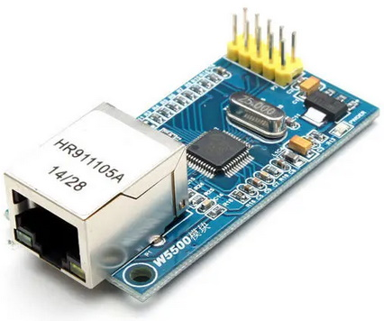
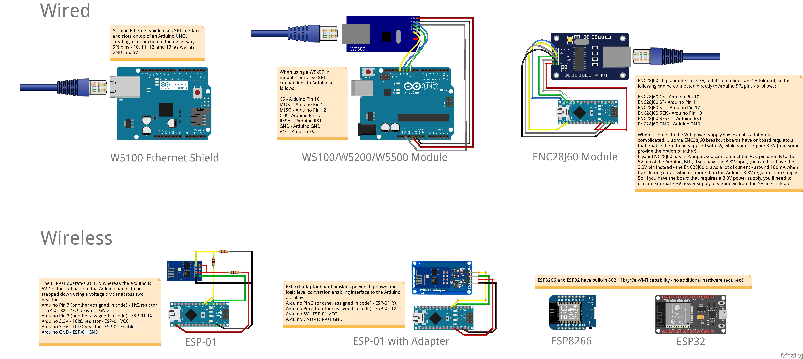
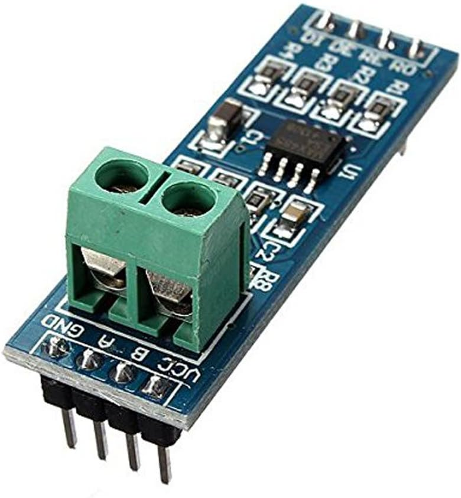
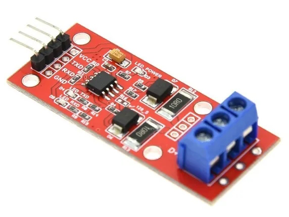
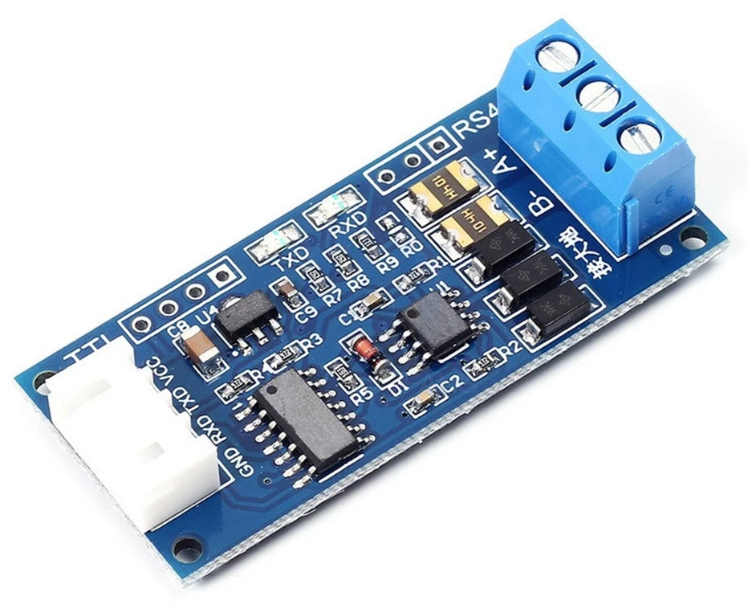

# arduino-networking
Wiring, software libraries, and example code of various common hardware used to create internet-enabled Arduino devices

# Ethernet

| Image | Chipset  | Type | Interface | Library  | Purchase |
| ----- | -------- | ---- | --------- | -------- | -------- |
|  | W5100 | Wired | SPI | https://github.com/arduino-libraries/Ethernet (supplied with Arduino IDE) | https://www.banggood.com/custlink/GK3GMBRWgl |
|  | W5500 | Wired | SPI |  https://github.com/arduino-libraries/Ethernet (supplied with Arduino IDE) | https://www.banggood.com/custlink/DvGD2QW3Cm |
|  | ENC28J60 | Wired | SPI | https://github.com/UIPEthernet/UIPEthernet | https://www.banggood.com/custlink/DDK3q4yC8a |
|  | ESP-01 (ESP8266) | Wi-Fi | Serial | https://github.com/willdurand/EspWiFi | https://www.banggood.com/custlink/GvGKqBRJeP |
|  | ESP8266 | Wi-Fi standalone | Standalone | https://github.com/esp8266/Arduino/tree/master/libraries/ESP8266WiFi (supplied with ESP8266 platform library) | https://www.banggood.com/custlink/KGvGM4kTLM |
|  | ESP32 | Wi-Fi standalone | Standalone | https://github.com/espressif/arduino-esp32/tree/master/libraries/WiFi (supplied with ESP32 platform library) | https://www.banggood.com/custlink/GvmKq6b0Rt |

# RS485
The MAX485 chip only operates at 5V logic. 
Many common TTL-to-R485 convertors therefore also only operate with 5V logic. 
| Image | Notes  |
| ----- | -------- |
|  | MAX485 5V only! |

The MAX13487 has auto-direction control, which means less pins, but still only operates with 5V logic.
| Image | Notes  |
| ----- | -------- |
|  | MAX13487 5V only! |

The MAX3485 (or SP3485, etc.) operate at 3.3V 
| Image | Notes  |
| ----- | -------- |
|  | MAX3485 3.3V/5V |

Barest implementation of a 3485 is https://www.aliexpress.com/item/1005006864113609.html

This board is nice, as it seems
120-ohm matching resistor that can be easily connected by shorting R0. 
 ESD protection and TVS overvoltage protection
 castellated edge pads

Other varieties exist, e.g.: https://www.aliexpress.com/item/1005006243340333.html
